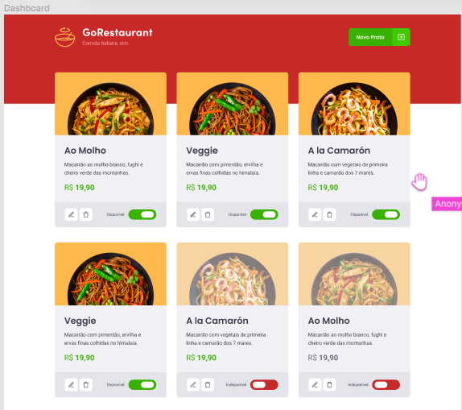
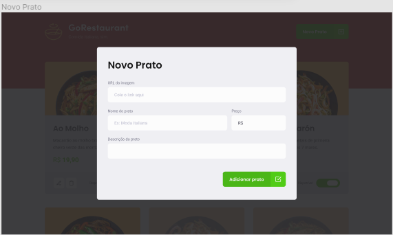

[](http://hits.dwyl.com/robertoarodrigues/robertoarodrigues/goRestaurantweb)

<p align="center">
  
</p>

# GoRestaurant
Este repositório é referente ao desafio 10 'CRUD React' do Bootcamp GoStack 11.0, da Rocketseat 🚀.
Nesse desafio foi desenvolvido uma aplicação web para praticar os conceitos de CRUD (Create, Read, Update, Delete).

<p align="center">
  
</p>

<p align="center">
  
</p>

# Construído com:

* React
* React Modal
* Styled-Components
* Jest
* React Icons
* Typescript

# Testes
Para inicializar todos os testes já preparados, utilize <code> yarn test </code>.

# Para Obter esse repositório:
Siga os passos:
1. Clone esse repositório utilizando <code>git clone</code>.
2. Rode o comando <code> yarn </code> na raíz da pasta do projeto clonado para baixar as dependências.
3. Rode <code>json-server server.json -p 3333</code> na raíz da pasta do projeto para inicializar a Fake API.
4. Rode <code> yarn start </code> na raíz da pasta do projeto para inicializar o servidor.
5. Happy Hacking!

Caso o projeto não mostre os produtos, rode <code>adb reverse tcp:3333 tcp:3333</code> antes de iniciar a Fake API

# Para contribuir:
Siga os passos:

```bash
# Clone o seu fork
$ git clone url-do-seu-fork && cd GoRestaurantWeb

# Crie uma branch com sua feature ou correção de bugs
$ git checkout -b minha-branch

# Faça o commit das suas alterações
$ git commit -m 'minhas alterações'

# Faça o push para a sua branch
$ git push origin minha-branch
```

# Autor:

* **Roberto Rodrigues** [Linkedin](https://www.linkedin.com/in/robertorodriguesazevedo/)
